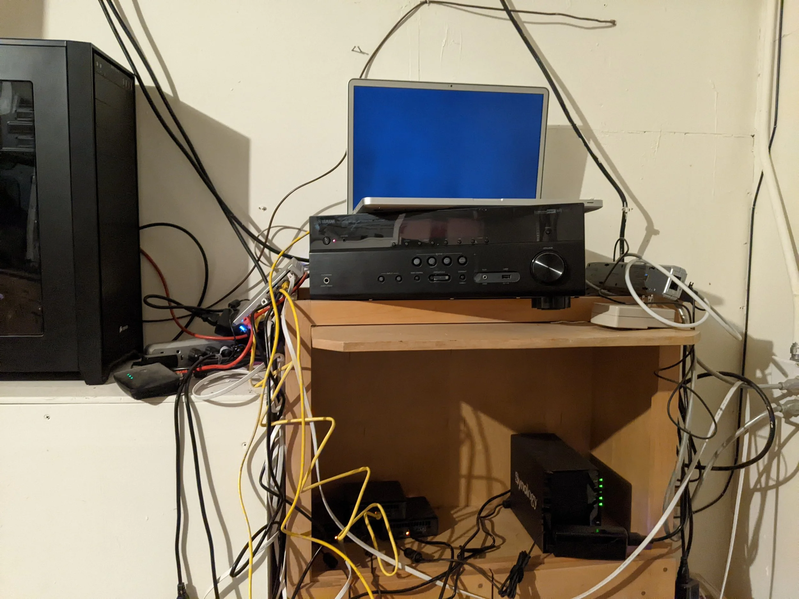

The rundown:

* 1x Unifi Dream Machine
* 2x Unifi US-8-60W switches
* 3x Intel NUC NUC10i3FNK - Kubernetes control nodes + some workload
* 1x Synology DSM220+ NAS - NFS for PV, Docker registry, Vault
* 1x custom beefy desktop (left), only runs if/when I need extra compute.
* 1x 2011 Macbook pro - GitHub Actions self-hosted runner

I mostly use this setup for experimenting with Kubernetes and PaaS-related things on top of it.
It hasn't burn the house down... yet!
